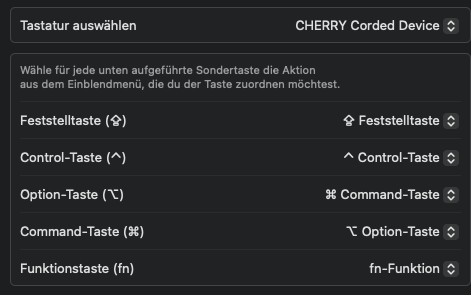

# Good | know
Most Window shortcuts are working on the MacOS, only the Keys and their behavior are slighty switched
| Windows Shortcut | Mac Shortcut|
|------|----|
|CTRL + c | CMD +c |
|CTRL + r| CMD +r|

Otherwise:
If you do not want memories the new behavior, so CTRL + c stays CTRL + c, map your Keyassignments like this:

:warning: not EVERY Shortcut will be the same, e.g. instead of ALT+TAB it will be than CTRL+TAB

- Control (Strg) → will be Command (⌘)
- Option (Alt) → stays at ALT
- Command (⌘) → will be zu STRG (^)

Here is the path for the Keyassignment **per Keyboard**

` Apple Symbol > Systemeinstellungen > Tastatur > Tastaturkurzbefehler > Sondertasten` in| this one:

# Keys on Apple Keyboard
| Key | Keyboard-Symbol |
|------|----|
| Fn (oder Globus) | fn |
| Control-Taste (oder Ctrl) | ⌃ |
| OPTION (oder Alt) | ⌥ |
| SHIFT| ⇧|
| Befehlstaste (oder CMD) |⌘|
| Esc (Escape)| ⎋|

# Shortcuts

## General
| Shortcut        | Result |
|-----------------|--------|
| CMD + Space | Spotlight Search |‚
| CMD + SHIFT + 4 | screenshot selection, save | desk|p |
| CMD + OPTION + SHIFT + 4 | screenshot selection, copy | clipboard |
| CMD + H | Hides the front window|
| CMD + Q | Terminate the front window app| 
| CMD + W |  Close the front window. |
| CMD + , | Open app settings page |
| ENTER | Rename a file |
| Space | quick view selected file|
| CMD + SHIFT + . | Show hidden files in finder|
| CMD + OPTION + ESC | Open task manager |
| CTRL + Left arrow/Right arrow | switch between Spaces|

## Daily Typing
| Shortcut        | Result |
|-----------------|--------|
| OPTION + L |  @   |
| OPTION + n      | ~      |
| OPTION + 5      | [      |
| OPTION + 6      | ]      |
| OPTION + 7      |  \|    |
| SHIFT + OPTION + 7  | \      |
| OPTION + 8  | {    |
| OPTION + 9  |  }   |
